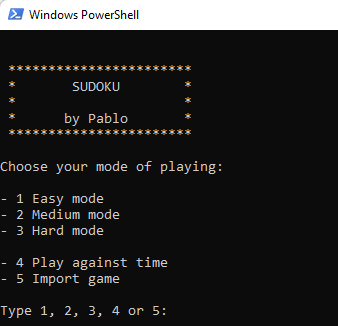
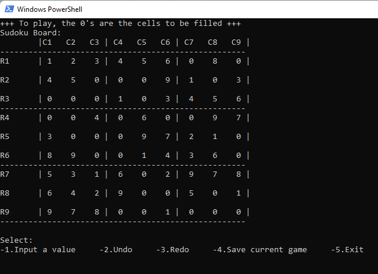

# Sudoku Game Implementation

This is a C-based console application for playing Sudoku, a popular number puzzle game. The implementation allows users to play Sudoku in a terminal, offering features like undo/redo moves, saving/loading games, and a timer for gameplay. 
<br>



## Features

- **Dynamic Sudoku Board Generation:** Generates a solvable Sudoku board each time the game starts.
- **Undo/Redo:** Allows the player to undo or redo moves, enhancing the gameplay experience.
- **Save/Load Game:** Players can save their current game state to a file and load it later to continue from where they left off.
- **Timer:** An optional timer can be enabled to limit the duration of the game, adding an extra challenge.
- **Input Validation:** Checks for duplicate numbers in rows, columns, and 3x3 boxes to ensure valid moves.

## Getting Started

### Prerequisites

- A C compiler (like GCC or Clang)
- Standard C libraries

### Compilation

To compile the game, use the following command in your terminal:

```bash
gcc Sudoku.c -o Sudoku
```


### Running the Game

After compilation, you can start the game using:

```bash
./Sudoku
```

Follow the on-screen instructions to play the game.

## Usage

1. **Start the Game:** The game starts with a partially filled Sudoku board. The objective is to fill the empty cells with numbers from 1 to 9.
2. **Make a Move:** Enter the row number, column number, and the value you wish to place in the specified cell.
3. **Undo/Redo Moves:** Choose the undo or redo option if you wish to revert or reapply your last action.
4. **Save/Load Game:** You can save your game progress at any time and load it later to continue.
5. **Exit:** You can exit the game anytime by selecting the exit option.

## Key Algorithms and Data Structures:

1. **Backtracking Algorithm:**
    - **Usage:** Generates and solves the Sudoku board.
    - **Function:** `populateBoardRecursively` tries numbers in each cell and backtracks if duplicates are found.

2. **Validation Functions:**
    - **Purpose:** Ensures no duplicates in rows, columns, and 3x3 boxes.
    - **Functions:** `duplicateInRow`, `duplicateInCol`, `duplicateInBox`, and `isBoardValid`.

3. **Data Structures:**
    - **2D Array:** Represents the Sudoku board (`int sudoku[9][9]`).
    - **Stack:** Used for undo/redo functionality with `struct stack`.

4. **File Handling:**
    - **Purpose:** Save and load game states.
    - **Functions:** `saveGame` and `readGame`.


## Demo
You can find a demo here: https://www.youtube.com/watch?v=3O1fJ-Pqw74
